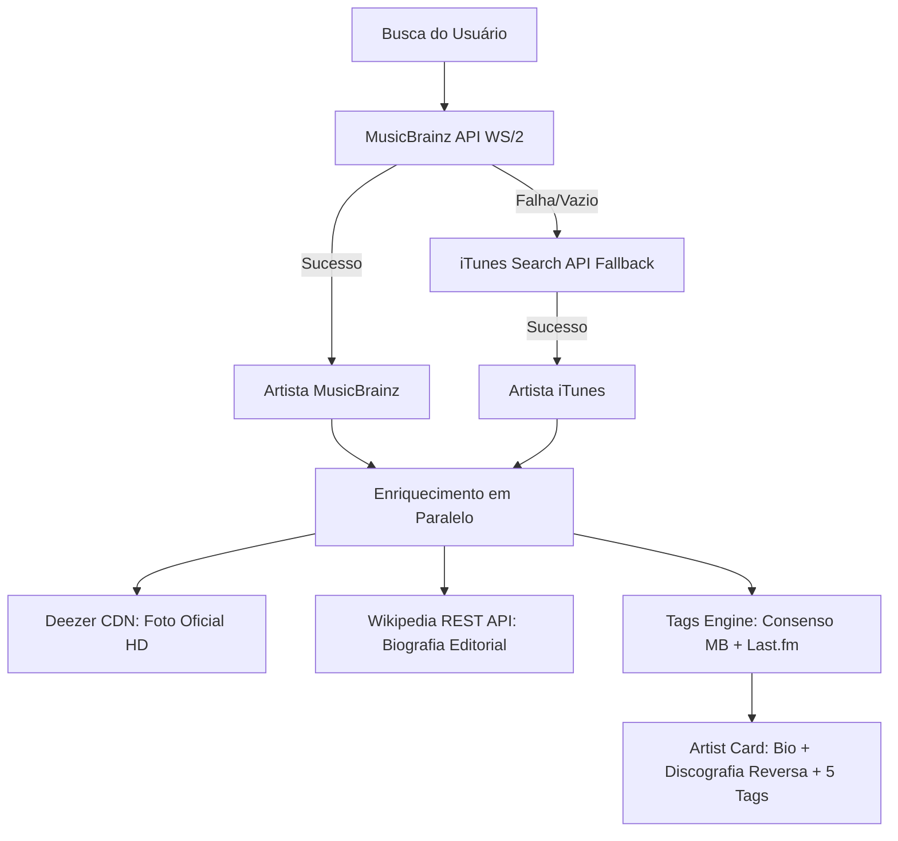

# 🎧 Sonar Music Engine & Discovery System

O **Sonar** é uma aplicação web de descoberta musical personalizada com visualização interativa em grafo ("universo sonoro"), desenvolvida em Next.js (App Router), TypeScript, Tailwind CSS e Cytoscape.js, integrada às APIs do MusicBrainz, Last.fm, iTunes, Deezer e Wikipedia.

---

## 1. Princípios e Diretrizes do Produto (Sonar.txt)

1. **Zero Login Obrigatório para Experimentar**:
   - O usuário pode montar seu perfil de artistas semente imediatamente sem telas de bloqueio ou formulários.
   - O perfil temporário é persistido localmente via Zustand (`localStorage`).
   - Autenticação (Google, Apple, Magic Link via Supabase) só é solicitada quando o usuário decide voluntariamente salvar ou sincronizar seu universo.
2. **Formatação Padronizada de Artistas (Seção 9 e 10)**:
   - Local e fundação sempre unificados na UI: `Country, Year` (ex: *"United States, 1985"* ou *"United Kingdom, 1994"*).
   - Discografia estritamente em **ordem cronológica inversa** (do álbum mais recente para o mais antigo).
3. **Visualização em Grafo (Cytoscape.js)**:
   - **Nós Cheios (●)**: Artistas conhecidos/curtidos pelo usuário (Sementes).
   - **Nós Vazios/Vazados (○)**: Recomendações e descobertas musicais calculadas pelo motor.
   - **Transparência ("Por que este artista apareceu?")**: O usuário pode abrir um modal explicativo mostrando quais sementes impulsionaram a recomendação e a afinidade calculada.
4. **Identidade Visual e Logo Multibeam (`SonarLogo.tsx`)**:
   - Silhueta baseada na física do sonar e no rascunho de ondas expansivas.
   - Escala térmica autêntica do ecobatímetro: **Azul Ciano ➔ Verde-Água ➔ Verde Sonar ➔ Amarelo ➔ Laranja ➔ Vermelho Sólido Flat**.
   - Animação de varredura acústica com pulso ortogonal (+12%) e pausa periódica de 3.2s a cada ciclo de 4.2s.

---

## 2. Pipeline de Dados e Multi-APIs

### Provedores e Responsabilidades:
1. **MusicBrainz (`ws/2/artist/`)**:
   - Fonte primária de identificadores canônicos (MBID), dados de formação, país, gêneros e grupos de lançamentos (discografia).
   - *Header Obrigatório*: `User-Agent: SonarMusicDiscovery/1.0.0 ( contact@sonar.app )`.
2. **iTunes Search API (`itunes.apple.com/search`)**:
   - Fallback de alta disponibilidade quando o MusicBrainz atinge limites de taxa ou não encontra o termo.
3. **Deezer CDN (`cdn-images.dzcdn.net`)**:
   - Fornece fotografias oficiais de alta resolução dos artistas sem necessidade de autenticação OAuth.
4. **Wikipedia REST API (`/api/rest_v1/page/summary/${name}_(band)`)**:
   - Fornece biografias editoriais curtas, limpas e sem restrições de cota para a seção "Sobre o Artista".
5. **Cover Art Archive (`coverartarchive.org/release-group/${id}/front-250`)**:
   - Imagens de capa oficiais dos álbuns da discografia.

---

## 3. Motor de Tags e Consenso (Tags Engine)

O sistema de afinidade musical utiliza a regra de **consenso entre MusicBrainz e Last.fm**:

### Regras de Negócio de Tags:
1. **Prioridade de Consenso**:
   - Tags que aparecem **em ambos os serviços** recebem peso e prioridade máxima, sendo exibidas no início da lista com destaque visual exclusivo (`★`).
2. **Tags de Aparição Única**:
   - Tags presentes em apenas um dos serviços complementam a lista após as tags de consenso.
3. **Limite Estrito**:
   - Exibir no **máximo 5 tags** por banda no card de detalhes.
4. **Filtro Anti-Ruído**:
   - Termos geográficos ou meta-tags são automaticamente descartados:
     `'american', 'usa', 'english', 'british', 'uk', 'california', 'united states', 'rock and indie', 'ambient', 'heavy', 'seen live', 'favorites', 'albums i own'`

---

## 4. Motor de Descoberta (Discovery Engine)

### Cálculo do Discovery Score
Para cada semente $S_i$ do usuário com peso $W_i$:
1. Coleta similaridades do Last.fm / subgênero: $Sim(S_i, C)$.
2. Acumula pontuação: $Score(C) = \sum [Sim(S_i, C) \times W_i]$.
3. Normaliza pela quantidade de sementes: $Score_{norm} = \frac{Score(C)}{\max(1.5, \sqrt{N_{seeds}})}$.
4. Categoriza em 4 distâncias musicais:
   - **Very Close** ($\ge 0.75$)
   - **Close** ($0.60 - 0.74$)
   - **Exploratory** ($0.45 - 0.59$)
   - **Surprising** ($< 0.45$)

### Filtro Anti-Junk:
Entidades que poluem o grafo são descartadas na origem:
`'various artists', '[unknown]', 'soundtrack', 'original soundtrack', 'compilation', 'tribute', 'karaoke', 'cast recording'`.

---

## 5. Layout Flutuante e Grafo Interativo (Cytoscape)

*(Adicionado em 2026-09-25 — sessão de correção de hidratação + redesign do layout do grafo)*

### 5.1 Arquitetura do layout (`page.tsx` + `MusicalMap.tsx`)
- O grafo (`MusicalMap`) ocupa `absolute inset-0` dentro de um container `relative` de tela cheia — **não tem "caixa" própria** (sem borda/rounded), fica como camada de fundo.
- **Desktop (`sm:` e acima)**: painéis "Monte seu Perfil Musical" e "Artistas no seu Perfil" empilhados num único bloco `sm:absolute sm:top-4 sm:left-4` flutuando por cima, `shadow-xl`, **sem borda**. Legenda "Universo Musical" (dentro do `MusicalMap`) no canto superior direito.
- **Mobile (abaixo de `sm:`)**: os dois painéis se **separam fisicamente** — busca fixa (`fixed`) no topo da tela, lista de artistas fixa no rodapé (`max-h-[35dvh]`, scroll interno), liberando o **centro da tela pro grafo** (pedido explícito do usuário: "está difícil de visualizar o grafo"). A legenda vai pro `bottom-4 right-4` nessa faixa (evita brigar por espaço com o painel de busca no topo-direito, que é estreito demais pro conteúdo dela).
- Técnica usada pra não duplicar JSX entre mobile/desktop: o wrapper dos dois painéis é `contents sm:flex sm:flex-col sm:absolute ...` — `contents` faz o wrapper "desaparecer" do layout no mobile (os filhos ficam livres pra ter cada um sua própria posição `fixed`), e a partir de `sm:` ele vira um flex container de verdade posicionado no canto, com os filhos em `sm:static` (fluxo normal, empilhados). Evita ter que calcular um offset manual (ex: `sm:top-[168px]`) pra encaixar o segundo painel embaixo do primeiro no desktop.
- O card de detalhes do artista selecionado (`ArtistCard`) continua no canto superior direito em toda largura — no mobile ele passa a ocupar `w-[calc(100%-2rem)]` com `max-h-[calc(100%-2rem)] overflow-y-auto` (ver armadilha na tabela).

### 5.2 Peso do artista = posição na lista = proximidade no grafo
- `UserArtist.weight` (0–1) já existia e alimentava o `discoveryEngine.ts` (`weightedScore = sim.score * seedWeight`). Agora ele também é **editável pelo usuário**: arrastando o ícone de grip (`GripVertical`) na lista "Artistas no seu Perfil", a nova posição vira o peso (`reorderSeedArtists` em `useProfileStore.ts`: topo = 1.0, decrescendo ~0.12 por posição).
- `getSeedArtists()` ordena por `weight` desc — a lista na UI reflete a prioridade.
- No `MusicalMap.tsx`, cada aresta carrega `seedImportance` (o peso da semente de origem) e `idealEdgeLength` é função disso: sementes mais importantes puxam suas descobertas pra mais perto de si.
- Drag-and-drop é HTML5 nativo (`draggable`, `onDragStart`/`onDragOver`/`onDrop` com `dataTransfer`) — **ferramentas de automação de mouse (ex: `left_click_drag`) não disparam esses eventos**; só um gesto real de arraste do usuário (ou `dispatchEvent(new DragEvent(...))` manual) funciona. Não é bug do app, é limitação de teste.

### 5.3 Como o `cose` layout realmente se comporta (armadilhas de tuning)
- Com `fit: true`, o Cytoscape **sempre** escala o resultado pra preencher o container inteiro menos o `padding`. Ou seja: **mudar `nodeRepulsion`/`idealEdgeLength` muda a forma relativa do grafo, mas não o quão "zoomado"/próximo ele parece na tela.** Quem controla isso é o `padding` (compare com o tamanho do container).
- `padding` precisa ser **proporcional ao tamanho do container**, nunca um pixel fixo: em telas estreitas (mobile), um padding grande (ex: 220px, bom pro desktop) excede a própria largura disponível e gera uma área de fit negativa (ver armadilha na tabela abaixo). Fórmula usada: `Math.max(20, Math.min(220, Math.min(rect.width, rect.height) * 0.3))`.
- `boundingBox` customizado no layout (usado para limitar o grafo a não invadir mais que 25% do painel lateral) tem que ter `x2 > x1` e `y2 > y1` sempre — só aplicar quando o container é largo o suficiente, senão cai num objeto inválido e o Cytoscape quebra na inicialização (não dá pra simplesmente confiar em `rect.width`/`rect.height` do momento).

### 5.4 Movimento orgânico contínuo ("flutuação" dos nós)
- Pedido do usuário: tirar a aparência estática/flat do grafo. Implementado em `MusicalMap.tsx` com `node.animate()` **por nó**, em loop recursivo: cada nó anima pra uma posição vizinha aleatória (`drift = 16px` de raio), com `duration` randomizado (3–5.5s) e `easing: 'ease-in-out-sine'`, e no `complete` chama a si mesmo de novo — looping indefinido. Início de cada nó escalonado com `setTimeout` aleatório (0–3s) pra não sincronizar todo mundo no mesmo pulso.
- **Isso é seguro** (diferente do loop interno do layout `cose` com `animate:true`, armadilha documentada acima): `node.animate()` passa pelo render loop principal do Cytoscape (`BRp.startRenderLoop`/`_renderFn`), que **checa `r.destroyed` de verdade** antes de cada frame — `cy.stop()` no cleanup interrompe essas animações corretamente. Mesmo assim, `floatNode()` confere `cy.destroyed()` no início de cada chamada, e os `setTimeout` do início escalonado são guardados num array e limpos (`clearTimeout`) no cleanup do efeito — defesa em profundidade, não custa nada.

### 5.5 Evitar reconstruir o grafo à toa (referências instáveis em React)
**Sintoma que o usuário percebeu**: o grafo re-randomizava a posição de todos os nós a cada clique/interação, não só quando sementes/descobertas mudavam de verdade — "por que o grafo fica se redesenhando a cada ato?".
- Causa raiz: em `page.tsx`, `seedArtists = getSeedArtists()` e `handleSelectMapNode` eram recalculados **a cada render do `HomePage`** (sem `useMemo`/`useCallback`). `getSeedArtists()` faz `.filter().sort()`, que sempre retorna um array **novo** — mesmo com o mesmo conteúdo. Como esses dois viram props (`seeds`, `onSelectArtist`) que estão nas dependências do `useEffect` de build do `MusicalMap`, **qualquer** re-render do `HomePage` (selecionar um nó, abrir um modal, tocar a prévia, etc.) trocava a referência e disparava reconstrução completa do grafo — e como o `cose` layout usa `randomize: true`, cada reconstrução gerava um arranjo visualmente diferente.
- Fix: `const seedArtists = useMemo(() => getSeedArtists(), [userArtists]);` (memoiza pela referência de `userArtists`, que só muda quando o Zustand store muda de verdade) e `const handleSelectMapNode = useCallback((...) => {...}, []);`. **Regra geral pro projeto**: qualquer valor computado (array/objeto/função) que vira prop de `MusicalMap` — ou de qualquer componente cujo `useEffect` reconstrói algo caro — precisa ser memoizado; nunca recalcular "ao vivo" dentro do corpo do componente sem `useMemo`/`useCallback` se for cruzar a fronteira de um componente filho com efeitos.

### 5.6 Camada decorativa de fundo ("constelação fantasma")
- Pedido do usuário, com referência visual salva em `.agents/skills/sonar-music-engine/references/background-graph-reference.webp` (mockup "Discovr" — grafo real em primeiro plano com fotos, e atrás uma rede de nós/partículas bem mais fraca e difusa, dando sensação de profundidade/universo maior).
- Implementado em `src/components/Map/BackgroundGraphLayer.tsx`, renderizado dentro do `MusicalMap` **antes** (atrás, na ordem do DOM) do container do canvas do Cytoscape — o canvas do Cytoscape não define `background-color` no seletor `core`, então fica transparente e deixa a camada de fundo aparecer nas áreas vazias.
- **Decisão de performance deliberada**: NÃO é uma segunda instância do Cytoscape (dobraria o custo de física/renderização à toa por algo puramente decorativo). É SVG (linhas + círculos) + ``s pra partículas, animados só com CSS (`@keyframes bg-float` em `tailwind.config.ts`, usando custom properties `--float-x`/`--float-y` por elemento) — sem nenhum JS rodando por frame, compositing via GPU.
- Densidade/tamanho ajustados depois do 1º teste (pedido do usuário): mais nós (16→24 fantasmas, 22→32 partículas), ~30% menores, opacidades mais baixas (linhas 0.12→0.07, nós 0.22→0.14, partículas 0.18→0.11) — mais sutil e "cheio" ao mesmo tempo.
- Vinheta sutil por cima (`radial-gradient(ellipse at center, transparent 45%, rgba(15,23,42,0.08) 100%)`), num `div` próprio depois do canvas do Cytoscape — `ellipse` acompanha a proporção largura/altura do container automaticamente, então se adapta a qualquer formato de tela sem precisar de JS/media queries.
- **Posições vêm de uma função pseudo-aleatória DETERMINÍSTICA** (`Math.sin(seed * 12.9898) * 43758.5453`, mesmo seed → mesmo valor), não `Math.random()` em render — mas isso sozinho **não bastou**: ver armadilha nova na tabela abaixo (`Math.sin()` diverge em casas decimais distantes entre servidor e cliente).

---

## 6. Armadilhas Crônicas e Soluções de Engenharia

| Problema Encontrado | Sintoma | Solução Implementada |
| :--- | :--- | :--- |
| **Windows Node v24 TLS** | `UNABLE_TO_VERIFY_LEAF_SIGNATURE` ao acessar APIs HTTPS externas. | Configurado `NODE_TLS_REJECT_UNAUTHORIZED=0` e inicialização com `--use-system-ca`. |
| **Race Conditions na Busca** | Digitar rápido fazia requisições anteriores mais lentas sobrescreverem o resultado mais recente. | Implementado `AbortController` cancelando requisições pendentes a cada novo keystroke. |
| **Transparência no Dropdown** | `backdrop-blur` com `bg-slate-900/98` deixava a lista de sementes visível por baixo. | Utilizada cor sólida hex `#090d24` com `opacity: 1` e `z-index: 50`. |
| **Colisão de Cache Next.js** | Rodar `next build` com `next dev` em paralelo gerava erro `MODULE_NOT_FOUND 331.js`. | **Regra**: Nunca executar build simultâneo ao servidor de desenvolvimento. Se corromper, excluir pasta `.next`. |
| **Hydration mismatch (Zustand `persist`)** | `Hydration failed because the server rendered HTML didn't match the client` ao carregar `/` com perfil salvo; derrubava o Cytoscape em cascata (`notify`/`isHeadless` null). | `persist` sem `skipHydration` reidrata do `localStorage` de forma síncrona no cliente, antes do 1º paint — servidor sempre renderiza vazio. Guard `mounted` (`useState(false)` + `useEffect`) em `page.tsx`; só a UI cuja estrutura muda com a lista (botão Limpar, lista/estado vazio) usa o valor "gateado" — `seedArtists` puro continua alimentando `MusicalMap`/fetch de descobertas p/ não atrasar a montagem do grafo. |
| **`cose` layout com `animate: true`** | `Uncaught TypeError: Cannot read properties of null (reading 'notify')`, crash intermitente em dev (Strict Mode monta/desmonta/remonta rápido). | Bug do próprio Cytoscape 3.34.3: o loop de animação do `cose` (`requestAnimationFrame` recursivo em `run()`) **não é cancelado** por `cy.stop()`/`cy.destroy()` (só `CoseLayout.stop()` seta uma flag que o loop nem checa). Solução: `animate: false` no layout — cálculo síncrono, sem esse risco. Nós "assentam" direto na posição final (perde a animação de acomodação). |
| **Rebuild do grafo a cada clique** | Mesmo com `animate:false`, ainda ocorria `Cannot read properties of null (reading 'isHeadless')` ao mover o mouse logo após clicar num nó. | `selectedArtistId`/`highlightKnown` nas deps do `useEffect` principal faziam destruir+recriar a instância inteira do Cytoscape a cada seleção/filtro — e o Cytoscape registra alguns listeners (`mousemove`) no `window`, não no elemento, então uma instância recém-destruída ainda podia ser alvo. Separado em 2 efeitos: um só reconstrói quando `seeds`/`discoveries` mudam (dados de verdade), outro só atualiza classes (`selected-node`/`emphasized`) via `cyRef.current` sem destruir nada. |
| **`boundingBox` customizado do `cose`** | `Cannot read properties of undefined (reading 'w')` ao montar o grafo em containers estreitos. | `makeBoundingBox()` do Cytoscape exige `x2 >= x1` **ou** um objeto com `w`/`h` — um `boundingBox: {x1,y1,x2,y2}` com `x2 < x1` (largura do container menor que o `x1` calculado) não bate em nenhum dos dois casos e a função retorna `undefined` silenciosamente. Só aplicar o `boundingBox` custom quando `container.width > reserva + largura mínima`; senão `undefined` (usa o padrão do Cytoscape). |
| **`fit:true` "esconde" o efeito de padding/repulsion** | Reduzir `nodeRepulsion`/`idealEdgeLength` não fazia os nós parecerem mais próximos na tela. | `fit:true` sempre reescala o resultado pra preencher o container inteiro — a "distância percebida" é controlada pelo `padding`, não pela física. Ver seção 5.3. |
| **`h-screen` (100vh) no Safari mobile** | Página "travada": painéis apareciam mas o grafo abaixo ficava inacessível, sem conseguir rolar (iPhone, Safari). | Barra de endereço dinâmica do Safari faz `100vh` calcular a altura errada. Trocado `h-screen` → `h-dvh` (dynamic viewport height, suportado desde Tailwind 3.4) em `page.tsx`. |
| **Padding fixo grande em telas estreitas** | Depois de ajustar `padding: 220` pro desktop ("nós mais próximos"), o grafo sumiu completamente no mobile. | `220px` de padding excede a largura de uma tela de ~375px, gerando área de fit negativa. Padding calculado como `Math.max(20, Math.min(220, Math.min(rect.width, rect.height) * 0.3))` — proporcional ao menor lado do container. |
| **Painel flutuante cobre o grafo inteiro no mobile** | Grafo renderizava (sem erro) mas ficava 100% atrás do painel — painel ocupava ~91% da largura e ~70% da altura da tela. | Abaixo do breakpoint `sm:`, painel usa `w-[78%]` + `max-h-[50dvh]` com scroll interno, deixando uma faixa do grafo sempre visível ao redor. |
| **Legenda "Universo Musical" cortada no mobile** | Texto sobreposto/ilegível (`"CAL"`, `"os"`, `"afinidade"` picotados) — a legenda ficava `top-4 right-4` mas a faixa livre à direita do painel (~22% da largura) era estreita demais pro conteúdo dela. | Responsiva: `bottom-4 right-4` por padrão (mobile), `sm:top-4 sm:bottom-auto` a partir do breakpoint — no mobile ela desce pra área livre abaixo do painel em vez de disputar a faixa estreita ao lado. |
| **`ArtistCard` sem teto de altura/scroll** | Card do artista selecionado podia (em tese) ultrapassar a viewport sem forma de rolar até o fim (`<main>` tem `overflow-hidden`); também vazava ~16px pra fora da tela à esquerda no mobile (`w-full` num `absolute` só com `right-4` fixado, sem `left`). | Wrapper em `page.tsx` ganhou `max-h-[calc(100%-2rem)] overflow-y-auto` e `w-[calc(100%-2rem)] sm:w-full` (mantendo `max-w-sm`). |
| **`Math.sin()` diverge entre servidor e cliente** | Hydration mismatch **mesmo usando uma função pseudo-aleatória "determinística"** (`BackgroundGraphLayer.tsx`) — atributos como `y1="11.035198903409764%"` (cliente) vs `y1="11.03519890276948%"` (servidor), divergindo só a partir da 9ª casa decimal. | `Math.sin()`/`Math.cos()` **não são garantidos bit-idênticos** entre motores JS diferentes (Node no servidor vs V8 do navegador) — mesma entrada, resultado marginalmente diferente na precisão de ponto flutuante. "Determinístico" só dentro do MESMO motor. Fix: arredondar (`Math.round(n * 100) / 100`) todo valor derivado de `Math.sin()` antes de virar atributo/string — a diferença é irrelevante visualmente e desaparece do HTML gerado. |
| **`dark:` classes no `SonarLogo` sem dark mode no app** | Texto "SONAR" do cabeçalho **invisível** (branco sobre fundo claro) em qualquer máquina com `prefers-color-scheme: dark` no SO — muito comum. | `tailwind.config.ts` não define `darkMode`, então o Tailwind usa a estratégia padrão `media`: qualquer classe `dark:` no código ativa sozinha com base no SO do usuário, **independente de o app ter uma UI de dark mode de verdade**. O resto do Sonar é sempre claro (`bg-[#eef0f4]` fixo), então qualquer `dark:*` introduzido em um componente novo (ex: `SonarLogo.tsx`, criado por outra ferramenta) quebra silenciosamente pra quem usa SO em modo escuro. Removidas todas as classes `dark:` do `SonarLogo.tsx`. **Regra**: não usar `dark:` em nenhum componente até o app implementar de fato um sistema de tema (toggle + `darkMode: 'class'` no config). |

---

## 7. Procedimento Operacional: Próximas Sessões

**Prioridade #1 (pedido explícito do usuário em 2026-09-25): acertar a versão mobile.**
O layout flutuante (painéis sobre o grafo em tela cheia) foi desenhado e testado primeiro pro desktop; passou por 3 rodadas de ajuste mobile no mesmo dia (todas só emuladas, Chrome DevTools 375×812):
- ~~Painel a 78%/50dvh cobria o grafo quase todo~~ — **corrigido na 3ª rodada**: busca e lista se separam no mobile (busca fixa no topo, lista fixa no rodapé, `max-h-[35dvh]`), liberando o **centro da tela** pro grafo (pedido explícito: "está difícil de visualizar o grafo"). Ver 5.1.
- ~~A legenda "Universo Musical" e o card de artista selecionado disputam o mesmo canto~~ — **corrigido na 2ª rodada**: no mobile a legenda vai pro `bottom-4 right-4` (`sm:top-4` volta ao canto original); ver 5.1/armadilhas.
- ~~O card de artista pode ultrapassar a viewport sem scroll~~ — **corrigido na 2ª rodada**: wrapper do `ArtistCard` em `page.tsx` ganhou `max-h-[calc(100%-2rem)] overflow-y-auto` e largura `w-[calc(100%-2rem)]` no mobile (antes vazava ~16px pra fora da tela à esquerda, por causa do `w-full` num elemento `absolute` só com `right` fixado).
- **Ainda falta**: confirmar em iPhone real (Safari) — toda a validação mobile até agora foi só emulada; o bug do `h-dvh` (rodada 1) só foi pego porque o usuário testou no aparelho de verdade, então não dá pra confiar 100% na emulação.
- Grip de drag-and-drop (`w-4 h-4` = 16px) pode ser pequeno demais pra toque confortável no mobile; não testado/ajustado ainda.
- Painel de busca fixo no topo do mobile não tem teto de altura — se o dropdown de resultados da busca crescer muito (muitos resultados), pode não caber; não veio à tona no teste (só 3 resultados), mas não foi estressado.

Tarefas já arquitetadas de sessões anteriores, ainda pendentes:

1. **Desduplicação Canônica de Nós**:
   - Impedir que artistas semente (ex: Isis) reapareçam como nós de descoberta.
   - Convergir candidatos comuns a múltiplas sementes (ex: Cult of Luna) em um único nó com conexões compartilhadas.
2. **Conexão Semente ↔ Semente via Tags**:
   - Traçar arestas diretas entre sementes que compartilham tags de consenso (ex: Neurosis ↔ Isis via *sludge metal* e *post-metal*).
3. **Carregamento Universal ao Clique**:
   - Ao clicar em qualquer nó do grafo Cytoscape (seja semente ou descoberta), resolver o MBID se necessário e carregar os dados completos (bio editorial, discografia reversa, capas e tags) no card de detalhes.

Feito na sessão de 2026-09-25 (não repetir):
- Layout flutuante (painéis sobre grafo em tela cheia, sem "caixa" no grafo); no mobile, busca e lista se separam (topo/rodapé) liberando o centro pro grafo.
- Reordenar sementes por drag (peso = posição, influencia grafo *e* discovery score).
- Filtro "Artistas Conhecidos" no painel Universo Musical (engrossa borda das sementes).
- Botões Gostar/Não Gostar como toggle on/off; removido "Já Conheço" do card.
- Nós do grafo com movimento orgânico contínuo (flutuação sutil via `node.animate()` em loop, ver 5.4).
- **Bug de performance/UX corrigido**: grafo reconstruía e re-randomizava a posição de todos os nós a cada interação (clique, etc.), não só quando sementes/descobertas mudavam — causa era `seedArtists`/`handleSelectMapNode` sem memoização em `page.tsx`, recriando referências a cada render. Ver 5.5 — regra geral pra manter em mente no resto do projeto.
- Prévia de 30s via iTunes Search API (`src/lib/services/itunes.ts`, `/api/preview`) — sem credenciais. Spotify real (embed com API própria) foi considerado e adiado por exigir Client ID/Secret do usuário.
- **Logo oficial "Sonar Multibeam"** integrado (`src/components/Logo/SonarLogo.tsx`, usado no cabeçalho em `page.tsx`, favicon em `src/app/icon.svg`): 7 colunas de círculos em gradiente térmico azul→ciano→verde→amarelo→laranja→vermelho (inspirado numa tela real de sonar multifeixe/ecobatímetro), com animação de "ping" periódico (4.2s) coluna por coluna. Concept art e o processo de decisão (comparando com outras 3 direções descartadas) estão em `docs/brand/` — esse trabalho de exploração de logo foi feito em paralelo por outra ferramenta (Gemini/Antigravity, a julgar pelos caminhos de arquivo), não pelo Claude, a partir do mesmo rascunho que o usuário também trouxe pra esta sessão. **Decisão do usuário**: só o logo usa essa paleta térmica; o resto do app mantém a identidade índigo/roxo/rosa já existente (ver seção 5.6 e o guia de prompts em `.agents/skills/sonar-music-engine/references/logo-branding-prompts.md`, que documenta a exploração feita nesta sessão — descartada em favor do resultado da outra ferramenta). Corrigido bug de `dark:` classes (ver tabela de armadilhas) e removido import morto (`Radio` do lucide-react, sobrando do ícone antigo) ao integrar.
- Camada decorativa "constelação fantasma" atrás do grafo (`BackgroundGraphLayer.tsx`, ver 5.6) — leve (SVG+CSS, sem Cytoscape), baseada na referência salva em `.agents/skills/sonar-music-engine/references/`.

## 8. Preparação pra Publicação (2026-09-25)

O projeto nunca tinha sido testado com `next build` (só `next dev`) nem tinha git. Preparado nesta sessão, ANTES de uma sessão separada assumir a publicação:

- **`git init` rodado** (repo ainda sem nenhum commit — proposital, não commitei nada sem pedido explícito).
- **`.gitignore` criado** (node_modules, .next, .env*.local, etc.).
- **`.env.example` criado** documentando as 3 chaves necessárias sem os valores: `LASTFM_API_KEY`, `NEXT_PUBLIC_SUPABASE_URL`, `NEXT_PUBLIC_SUPABASE_ANON_KEY`. `NODE_TLS_REJECT_UNAUTHORIZED=0` é só workaround local de Windows — não deve ir pra produção/Vercel.
- **`npm run build` corrigido e verificado com sucesso.** Achou um erro real de tipo que bloqueava o build: `MusicalMap.tsx` usa strings `mapData(...)` do Cytoscape em `opacity`/`text-opacity`/`line-opacity`, válidas em runtime mas fora do tipo `number` que `@types/cytoscape` espera. Corrigido com cast pontual `as unknown as number` nos 3 pontos (não afeta comportamento, só satisfaz o type-checker). **Armadilha nova pra tabela da seção 6, resumida aqui**: qualquer novo estilo Cytoscape com `mapData()`/`mapLinear()` em campo numérico (opacity, width em alguns casos, etc.) provavelmente vai precisar do mesmo cast.
- **Ainda pendente pra quem for publicar**: nenhum commit feito, nenhum remote configurado, nenhum deploy iniciado — tudo isso fica pra próxima sessão. Confirmar as 3 env vars reais no painel do provedor de deploy (Vercel ou outro) antes do primeiro build lá.
